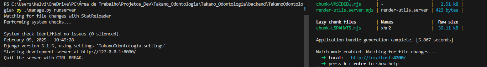

# TakanoOdontologia

Este projeto é uma aplicação web para a clínica odontológica Takano Odontologia. O projeto é dividido em duas partes: o backend, desenvolvido com Django, e o frontend, desenvolvido com Angular.

Acesso online do ambiente de produção do site:
URL: [www.takanoOdontologia.com](https://www.takanoodontologia.com.br/)

## Estrutura do Projeto
- Backend
    - TakanoOdontologia (Projeto Django)
- Frontend (Projeto Angular)


## Pré-requisitos

- [Python 3.12](https://www.python.org/downloads/)
- [Node.js](https://nodejs.org/en/download/) e [npm](https://www.npmjs.com/get-npm)
- [Angular CLI](https://angular.io/cli)

## Configuração do Ambiente

### Importe projeto localmente
1. **Clone o repositório:**


```sh
git clone https://github.com/PaulinSlatt/Takano_Odontologia.git

```

2. **Vá ao diretório**
```sh
cd Takano_Odontologia/
```

### Inicie o Backend (Django)

1. **Vá a diretório do Backend:**

    ```sh
    cd backend/
    ```

2. **Crie e ative um ambiente virtual:**

    Observação: Verifique que tenha Python, pip e pipenv instalado

    #### Iniciando o ambiente no pipenv

    ```sh
    pipenv shell 
    ```

3. **Instale as dependências:**
    #### pipenv
    ```sh
    pipenv install 
    ```

    #### pip
    ```sh
    pip install -r requirements.txt
    ```

    
4. **Configure o banco de dados:**
    #### Vá para pasta onde se encontra o script manage.py
    ```sh
    cd TakanoOdontologia/
    ```

    #### Execute o comando para realizar a configuração do banco

    ```sh
    python manage.py migrate
    ```

5. **Crie um superusuário:**
    #### Execute para criar um usuario admin para que possa ter acesso administrativo dos dados e qualquer gestão do backend. 

    - Obs: Execute em comandos como powershell, cmd, etc. Pois é necessario interagir com o shell para criar o usuario. 
    ```sh
    python manage.py createsuperuser
    ```

6. **Configurar o arquivo [.env](http://_vscodecontentref_/2):**

    Crie um arquivo [.env](http://_vscodecontentref_/3) na raiz do diretório [backend](http://_vscodecontentref_/4) e adicione as seguintes variáveis de ambiente:

    ```env
    DEBUG=True
    SECRET_KEY=your_secret_key
    DATABASE_URL=sqlite:///db.sqlite3
    EMAIL_HOST=smtp.mailtrap.io
    EMAIL_HOST_USER=your_mailtrap_username
    EMAIL_HOST_PASSWORD=your_mailtrap_password
    EMAIL_PORT=587
    ```

    Certifique-se de substituir `your_secret_key`, `your_mailtrap_username` e `your_mailtrap_password` pelos valores apropriados.

7. **Inicie o servidor de desenvolvimento:**

    ```sh
    python manage.py runserver
    ```

    O servidor estará disponível em `http://localhost:8000/`.

### Inicie o Frontend (Angular)

1. **Navegue até o diretório do frontend:**

    ```sh
    cd ../frontend
    ```

2. **Instale as dependências:**

    ```sh
    npm install
    ```

3. **Inicie o servidor de desenvolvimento:**

    ```sh
    ng serve
    ```

    A aplicação estará disponível em `http://localhost:4200/`.


### Ambiente final entre os dois ambientes (Backend / Frontend)


## Comandos Úteis

### Backend

- **Iniciar o servidor de desenvolvimento:**

    ```sh
    python manage.py runserver
    ```

- **Executar testes:**

    ```sh
    python manage.py test
    ```

### Frontend

- **Iniciar o servidor de desenvolvimento:**

    ```sh
    ng serve
    ```

- **Gerar um novo componente:**

    ```sh
    ng generate component component-name
    ```

- **Executar testes unitários:**

    ```sh
    ng test
    ```

- **Executar testes end-to-end:**

    ```sh
    ng e2e
    ```

## Contribuição

Se você deseja contribuir com este projeto, por favor, faça um fork do repositório e envie um pull request com suas alterações.

## Licença

Este projeto está licenciado sob a MIT License.